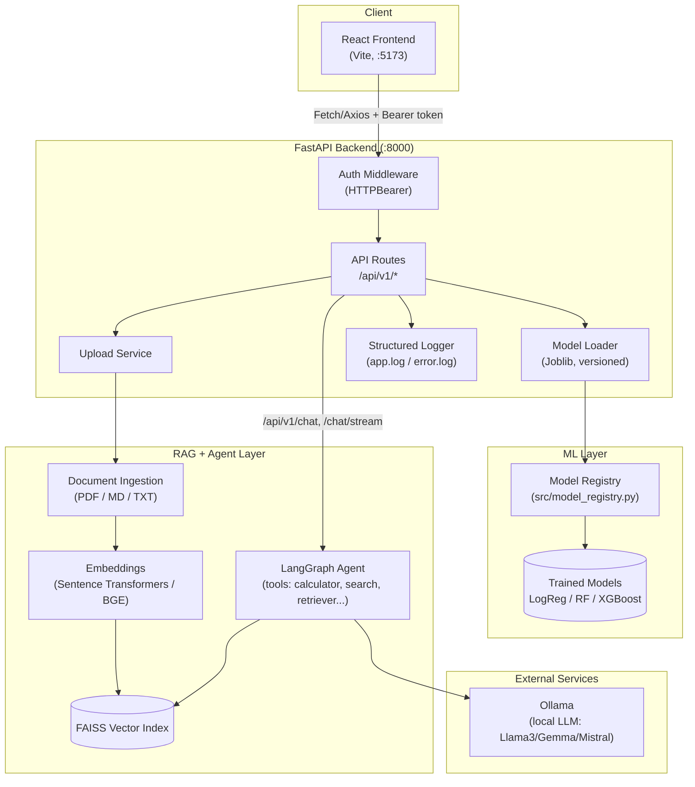
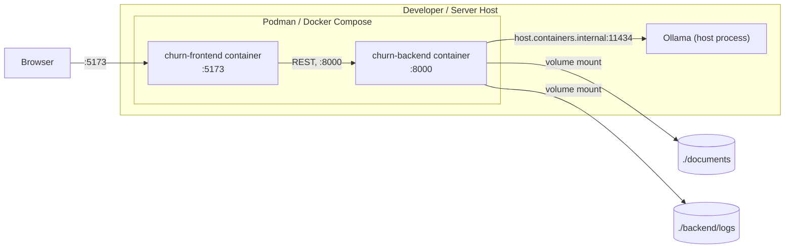

# Production-Ready AI Knowledge Platform

A full-stack application combining a **machine learning customer churn prediction service** with a **Retrieval-Augmented Generation (RAG) chatbot** and a **multi-tool AI agent**, served through a FastAPI backend and a React frontend. The chatbot runs locally via **Ollama**, with document retrieval powered by a **FAISS** vector index.

This project was built across four phases: ML engineering & MLOps, a GenAI chatbot with a React UI, an advanced RAG + agentic AI pipeline, and a production-ready full-stack deployment with CI/CD.

---

## Table of Contents

1. [Features](#features)
2. [Architecture](#architecture)
3. [Technology Stack](#technology-stack)
4. [Project Structure](#project-structure)
5. [Getting Started](#getting-started)
6. [Running with Containers (Podman/Docker)](#running-with-containers-podmandocker)
7. [Running Locally (Without Containers)](#running-locally-without-containers)
8. [API Documentation](#api-documentation)
9. [RAG Pipeline](#rag-pipeline)
10. [Agentic AI](#agentic-ai)
11. [Standard RAG vs. Agentic AI](#standard-rag-vs-agentic-ai)
12. [Evaluation Results](#evaluation-results)
13. [Model Registry & Versioning](#model-registry--versioning)
14. [Prompt Iteration History](#prompt-iteration-history)
15. [CI/CD](#cicd)
16. [Troubleshooting](#troubleshooting)
17. [Key Design Decisions](#key-design-decisions)
18. [Production Considerations](#production-considerations-beyond-this-project)

---

## Features

- **Customer churn prediction** using three trained ML models (Logistic Regression, Random Forest, XGBoost), each versioned in a lightweight model registry with MLflow-tracked metrics.
- **AI chatbot** built with LangChain, running a local open-source LLM through Ollama — supports natural conversation, structured JSON responses, streaming, and conversation memory.
- **RAG pipeline** for document-grounded answers: ingest PDF/Markdown/text documents, chunk them, embed with Sentence Transformers, store in FAISS, and retrieve with metadata filtering and citations.
- **Multi-tool AI agent** (LangGraph) that can use a Calculator, Wikipedia, DuckDuckGo Search, a Python REPL, a File Reader, and the Document Retriever — with multi-step reasoning, tool selection, memory, execution tracing, and error recovery.
- **React frontend** with a sidebar, chat history, a churn-prediction form, document upload, and a dark/light theme toggle.
- **Authenticated, versioned REST API** (FastAPI) with request validation, structured logging, and a real health check (verifies both Ollama connectivity and FAISS index availability).
- **Containerized deployment** (Podman/Docker Compose) and a **GitHub Actions CI pipeline** covering backend tests, frontend build, linting, and Docker build validation.

---

## Architecture

### System Diagram



### Deployment Topology



### Component Breakdown

**Frontend (`frontend/`)** — React + Vite. Sidebar navigation, chat panel with history, churn prediction form, document upload, and a dark/light theme toggle persisted via `localStorage`. Talks to the backend via `services/api.js`, authenticated with a bearer token.

**Backend (`backend/`)** — FastAPI. `HTTPBearer` auth on protected routes, all routes namespaced under `/api/v1/`, Pydantic validation (`Customer`, `PredictionResponse`, `ChatRequest`), structured logs (`backend/logs/app.log`, `error.log`), and a health check that verifies both Ollama connectivity and FAISS index availability.

**ML Layer (`src/`, `models/`)** — Models trained and tuned with MLflow experiment tracking, dataset versioned with DVC, persisted with Joblib, loaded on demand through a version-aware model registry.

**RAG + Agent Layer (`rag/`, `agent/`)** — Document ingestion (PDF/Markdown/text) → chunking → Sentence Transformer embeddings → FAISS vector store with metadata filtering. A LangGraph agent adds multi-step reasoning and six tools on top of plain retrieval.

**External Services** — Ollama serves the local LLM. The backend container reaches it via `host.containers.internal`, so it can use the LLM already running on the host machine without containerizing Ollama itself.

---

## Technology Stack

| Category | Tools |
|---|---|
| Backend | FastAPI, Uvicorn, Pydantic |
| Machine Learning | Scikit-learn, XGBoost, Pandas, Joblib |
| Experiment Tracking | MLflow |
| Dataset/Model Versioning | Git, DVC |
| GenAI Orchestration | LangChain, LangGraph |
| LLM Runtime | Ollama (Llama 3 / Gemma / Mistral / Phi) |
| Embeddings | Sentence Transformers / BAAI BGE |
| Vector Database | FAISS |
| Document Parsing | pypdf, pdfplumber (table-aware extraction) |
| Frontend | React, Vite |
| Testing | Pytest, pytest-cov |
| Linting/Formatting | Ruff, Black, isort, pre-commit |
| Containerization | Podman (Docker-compatible `Containerfile`s), Compose |
| CI/CD | GitHub Actions |
| API Testing | Swagger UI (built into FastAPI) |

---

## Project Structure

```
week-4/
│
├── backend/
│   ├── api.py                 # FastAPI app, all /api/v1/* routes
│   ├── config.py               # Env-driven configuration (API_TOKEN, etc.)
│   ├── logger.py                # Structured logging setup
│   ├── model_loader.py          # Loads versioned models via the registry
│   ├── schemas.py                # Pydantic request/response models
│   └── logs/                      # app.log, error.log (volume-mounted)
│
├── chatbot/
│   ├── chains.py                 # ChurnChatbot — main chatbot class
│   ├── customer_extractor.py     # Extracts customer fields from chat
│   ├── customer_normalizer.py    # Normalizes extracted fields
│   ├── document_intent.py        # Detects "list documents" style questions
│   ├── summarization_intent.py   # Detects whole-document summary requests
│   ├── error_handler.py          # Maps exceptions to safe chat responses
│   ├── llm.py                    # Ollama LLM configuration + streaming
│   ├── memory.py                 # Conversation memory wrapper
│   ├── parser.py                 # Parses/validates structured LLM output
│   ├── prediction_client.py      # Calls /api/v1/predict from the chatbot
│   ├── prediction_intent.py      # Detects churn-prediction requests
│   └── prompts.py                # System prompt (see Prompt Iteration History)
│
├── rag/
│   ├── ingestion/document_loader.py     # PDF/MD/TXT loading, table-aware
│   ├── chunking/text_chunker.py          # Hybrid section-aware + recursive chunking
│   ├── chunking/fixed_chunker.py         # Naive fixed-size chunking (comparison baseline)
│   ├── embeddings/embedder.py             # Sentence Transformers, normalized (cosine similarity)
│   ├── vectorstore/faiss_store.py         # Builds/persists the FAISS index
│   ├── retrieval/retriever.py              # SemanticRetriever, metadata filtering
│   ├── generation/rag_chain.py             # Retrieval + grounded generation
│   ├── generation/summarizer.py            # Whole-document map-reduce summarization
│   └── evaluation/                          # Recall@K and chunking-strategy experiments
│
├── agent/
│   ├── agent.py                   # LangGraph agent, shared checkpointer for real memory
│   └── tools/                      # calculator, wikipedia, web_search, python_repl,
│                                     # file_reader, document_retriever
│
├── src/
│   ├── train.py                    # Baseline model training (Pipeline-based)
│   ├── tuning.py                   # RandomizedSearchCV + MLflow + model registry
│   ├── evaluate.py                  # Loads tuned models, computes metrics
│   └── model_registry.py            # Lightweight versioned model registry
│
├── frontend/
│   └── src/
│       ├── App.jsx                  # Routing between Dashboard/Assistant/Predictions/Knowledge Base
│       ├── components/               # chat/, common/ (Sidebar, Header, DocumentUpload), prediction/
│       ├── hooks/useChat.js           # Chat state, streaming, session id
│       └── services/api.js            # All backend REST calls
│
├── models/                            # Trained model artifacts (.pkl) + registry.json
├── data/                               # Training dataset
├── documents/                           # Uploaded RAG documents (volume-mounted)
├── notebooks/                            # EDA + demo notebooks
├── tests/                                 # Pytest suite (96%+ coverage)
├── docs/                                   # Architecture, API, deployment, troubleshooting docs
├── .github/workflows/ci.yml                 # CI pipeline (lint, test, build)
├── Containerfile                             # Backend container definition
├── frontend/Containerfile                     # Frontend container definition
├── compose.yaml                                # Podman/Docker Compose services
├── requirements-train.txt                       # Minimal deps for the training container
├── requirements-inference.txt                    # Minimal deps for the backend/inference container
├── requirements.txt                               # Full dev environment (all tooling)
└── config.yaml                                     # Centralized experiment configuration
```

---

## Getting Started

### Prerequisites

| Requirement | Notes |
|---|---|
| Python 3.11 | Backend, ML training |
| Node.js 22 | Frontend |
| Podman (or Docker) | Containerized deployment; this project uses `Containerfile` naming, compatible with both |
| Podman Compose (or Docker Compose) | `podman compose` or `docker compose` |
| Ollama | Installed and running on the **host** machine (not containerized) |
| Git | To clone the repository |

> **Windows users:** Podman requires a Linux VM to run containers (via WSL2). See [Troubleshooting](#troubleshooting) if `podman machine start` fails.

### Clone the repository

```bash
git clone https://github.com/prathamaltdubey-office/Production-Ready-AI-Knowledge-Platform.git
cd week-4
```

### Install and start Ollama

```bash
ollama serve
ollama pull llama3.2:3b   # or gemma, mistral, phi — whichever model you configure
```

Confirm it's reachable:

```bash
curl http://localhost:11434
```

### Configure environment variables

This project uses **two** `.env` files.

**Root `.env`:**

```env
API_TOKEN=your-secret-token-here
OLLAMA_BASE_URL=http://host.containers.internal:11434
VITE_API_BASE_URL=http://localhost:8000
VITE_API_TOKEN=your-secret-token-here
```

**`frontend/.env`:**

```env
VITE_API_BASE_URL=http://localhost:8000
VITE_API_TOKEN=your-secret-token-here
```

> `API_TOKEN` and `VITE_API_TOKEN` must match — the frontend sends this token to authenticate against the backend's bearer-token check. Never commit real `.env` files; commit `.env.example` files with placeholder values instead.

---

## Running with Containers (Podman/Docker)

```bash
podman compose up --build
```

*(or `docker compose up --build` if using Docker)*

| Service | Container | Port | Built from |
|---|---|---|---|
| Backend (FastAPI) | `churn-backend` | `8000` | `Containerfile` (root) |
| Frontend (React/Vite) | `churn-frontend` | `5173` | `frontend/Containerfile` |

**Verify it worked:**

```bash
curl http://localhost:8000/api/v1/health
```

Expected:

```json
{ "status": "healthy", "ollama": "up", "faiss_index": "loaded" }
```

Open `http://localhost:5173` for the app, and `http://localhost:8000/docs` for interactive Swagger API docs.

**Stop:**

```bash
podman compose down
```

**Rebuild after code changes:**

```bash
podman compose down
podman compose up --build
```

If you change dependencies specifically and want a guaranteed clean reinstall (not just a cache-hit rebuild):

```bash
podman compose build --no-cache backend
podman compose up -d --force-recreate backend
```

### Volumes

| Host path | Container path | Purpose |
|---|---|---|
| `./documents` | `/app/documents` | Uploaded RAG documents persist across restarts |
| `./backend/logs` | `/app/backend/logs` | Structured logs persist across restarts |

### Training container (ML pipeline)

A separate, minimal container handles model training (kept intentionally lean — no LangChain/RAG/Streamlit dependencies, since training doesn't need them):

```bash
podman build -f Dockerfile.train -t churn-training .
podman run --rm \
  -v ./models:/app/models:Z \
  -v ./mlruns:/app/mlruns:Z \
  -v ./reports:/app/reports:Z \
  churn-training
```

---

## Running Locally (Without Containers)

**Terminal 1 — Backend:**

```bash
python -m uvicorn backend.api:app --reload
```

Runs at `http://127.0.0.1:8000`; Swagger UI at `http://127.0.0.1:8000/docs`.

**Terminal 2 — Frontend:**

```bash
cd frontend
npm install
npm run dev
```

Runs at `http://localhost:5173`.

**Terminal 3 — Ollama** (if not already running as a service):

```bash
ollama serve
```

> The prediction API does not depend on Ollama and works independently. Only the chat/RAG features require Ollama to be running.

---

## API Documentation

Base URL (local): `http://localhost:8000`. All endpoints are versioned under `/api/v1/` except the root landing route. Interactive Swagger docs are always available at `/docs`.

### Authentication

Protected endpoints require:

```
Authorization: Bearer <API_TOKEN>
```

Missing/invalid tokens receive `401 Unauthorized`.

### Endpoints

| Method | Endpoint | Auth | Purpose |
|---|---|---|---|
| GET | `/` | No | Landing route, basic service info |
| GET | `/api/v1/health` | No | Health check (Ollama + FAISS status) |
| GET | `/api/v1/models` | No | List available ML models |
| GET | `/api/v1/models/{model_name}/versions` | Yes | List registered versions of a model |
| POST | `/api/v1/predict` | Yes | Predict customer churn |
| POST | `/api/v1/chat` | Yes | Chat with the AI assistant (full response) |
| POST | `/api/v1/chat/stream` | Yes | Chat with the AI assistant (streamed tokens) |
| POST | `/api/v1/upload` | Yes | Upload a document into the RAG index |
| GET | `/api/v1/documents` | Yes | List ingested documents |
| GET | `/api/v1/documents/{filename}/content` | Yes | Get a document's content |
| DELETE | `/api/v1/documents/{filename}` | Yes | Remove a document and rebuild the index |

### `GET /api/v1/health`

```json
{ "status": "healthy", "ollama": "up", "faiss_index": "loaded" }
```

`status` is `"healthy"` only if both Ollama and the FAISS index are available; otherwise `"degraded"`.

### `POST /api/v1/predict`

**Query parameters:** `model_name` (e.g. `random_forest`), `model_version` (defaults to `"latest"`).

**Request body** (`Customer`):

```json
{
  "gender": "Female", "SeniorCitizen": 0, "Partner": "Yes", "Dependents": "No",
  "tenure": 12, "PhoneService": "Yes", "MultipleLines": "No",
  "InternetService": "Fiber optic", "OnlineSecurity": "No", "OnlineBackup": "Yes",
  "DeviceProtection": "No", "TechSupport": "No", "StreamingTV": "Yes",
  "StreamingMovies": "No", "Contract": "Month-to-month", "PaperlessBilling": "Yes",
  "PaymentMethod": "Electronic check", "MonthlyCharges": 70.35, "TotalCharges": 845.5
}
```

**Response:**

```json
{ "prediction": 1, "churn_probability": 0.734, "risk_level": "High", "model": "random_forest" }
```

Risk levels: `High` (≥0.70), `Medium` (0.40–0.69), `Low` (<0.40).

### `POST /api/v1/chat` / `/api/v1/chat/stream`

**Request body** (`ChatRequest`):

```json
{ "message": "What factors most influence customer churn?", "session_id": "default", "source": null }
```

- `session_id` maintains conversation memory **per session** — each session gets its own chatbot instance, so concurrent users don't share memory or customer data.
- `source` optionally restricts a chat question to a single uploaded document (RAG scoping).
- `/chat` returns a complete `ChatResponse`; `/chat/stream` streams the same content incrementally.

**Example response:**

```json
{
  "answer": "The Random Forest model predicts that this customer is unlikely to churn...",
  "topic": "churn prediction",
  "confidence": 1.0,
  "prediction": 0,
  "churn_probability": 0.2938,
  "risk_level": "Low",
  "model": "random_forest"
}
```

### Error Handling

All endpoints use FastAPI `HTTPException` with a consistent shape:

```json
{ "detail": "Human-readable error message" }
```

| Code | Meaning |
|---|---|
| 400 | Invalid request (bad model name/version) |
| 401 | Missing or invalid auth token |
| 404 | Resource not found |
| 500 | Internal server error (logged via `logger.exception`) |

---

## RAG Pipeline

1. **Ingestion** — PDF, Markdown, and plain text supported. PDFs are parsed with `pdfplumber` for table-aware extraction (tables are converted to Markdown format, preserving row/column relationships instead of being flattened into scrambled text).
2. **Chunking** — a hybrid section-aware + recursive splitter is the primary strategy; a naive fixed-size chunker exists as a comparison baseline (see [Evaluation Results](#evaluation-results)).
3. **Embeddings** — Sentence Transformers, **normalized** so FAISS's inner-product search is mathematically equivalent to cosine similarity.
4. **Vector store** — FAISS, with metadata filtering to scope retrieval to a single document by filename.
5. **Generation** — retrieved chunks are passed to the LLM for a grounded answer with source citations. Out-of-scope questions are correctly answered as "not available in the provided documents" rather than hallucinated.
6. **Special-cased query types** — "how many documents do you have" style meta-questions bypass retrieval and read the filesystem directly (avoids unreliable chunk-based guessing); whole-document summarization uses a separate map-reduce path over the full document text rather than a handful of retrieved chunks.

---

## Agentic AI

Built with LangGraph on top of the RAG pipeline. The agent can select and combine six tools per request:

| Tool | Purpose |
|---|---|
| Calculator | Mathematical calculations, with input validation and safe evaluation |
| Wikipedia | General factual information, including disambiguation handling |
| DuckDuckGo Search | Web search for current information |
| Python REPL | Sandboxed code execution (restricted builtins, blocked dangerous patterns) |
| File Reader | Reads local PDF/Markdown/text files, blocks path traversal |
| Document Retriever | Calls the same RAG retrieval pipeline used elsewhere in the app |

**Capabilities:** multi-step reasoning (e.g., retrieve a figure from a document, then calculate a percentage of it), dynamic tool selection, conversational memory (a shared checkpointer across calls, keyed by `thread_id`), execution tracing (full message/tool-call history), and per-tool error recovery (division by zero, missing files, empty queries all return clean messages instead of crashing).

---

## Standard RAG vs. Agentic AI

| Capability | Standard RAG | Agentic AI |
|---|---|---|
| Enterprise document questions | Yes | Yes |
| Semantic document retrieval | Yes | Yes |
| Grounded responses | Yes | Yes |
| Mathematical calculations | Document-dependent | Calculator tool |
| Web search | No | DuckDuckGo tool |
| Wikipedia search | No | Wikipedia tool |
| Python execution | No | Python REPL |
| Local file reading | No | File Reader |
| Multiple tools in one request | No | Yes |
| Dynamic tool selection | No | Yes |
| Multi-step execution | Limited | Yes |
| Error recovery | Basic | Tool-aware recovery |
| Conversational memory | Limited | Implemented |

**Example (multi-step):** *"What is SmartTech Co.'s market share according to the SmartHome Hub document, and calculate what 35% of the projected $135.3 billion smart home market would be?"*
→ Document Retriever finds 35% market share → Calculator computes 0.35 × $135.3B → **$47.355 billion**, combined into one final answer.

**Example (RAG's limit, agent's advantage):** *"What is 125 multiplied by 48?"* — Standard RAG correctly reports the calculation isn't in the documents; the agent recognizes the math request and uses the Calculator tool to return **6000**.

---

## Evaluation Results

### Retrieval (Recall@K)

| Retrieval Depth | Recall |
|---|---:|
| Recall@3 | 62.50% |
| Recall@5 | 75.00% |
| Recall@7 | 100.00% |

**Best retrieval depth: K = 7.**

### Chunking Strategy Comparison

Two strategies were compared at chunk_size=500, chunk_overlap=50:

| Strategy | Chunks | Recall@3 | Recall@5 | Recall@7 |
|---|---:|---:|---:|---:|
| Hybrid (section-aware + recursive) | 11 | 62.50% | 75.00% | 100.00% |
| Naive fixed-size | 9 | 75.00% | 100.00% | 100.00% |

The naive fixed-size chunker slightly outperformed the hybrid strategy at shallow depths — likely because section-aware splitting can separate a keyword from its surrounding context at section boundaries. Both converge at K=7. This is treated as an indicative finding on a small evaluation set, not a conclusive result.

### Generation

| Metric | Result |
|---|---:|
| Total queries | 8 |
| Successful queries | 8 |
| Generation Success Rate | 100.00% |

A grounded-response test (an out-of-scope question, "What is the population of Mars?") correctly returned "not available in the provided documents" rather than a fabricated answer.

---

## Model Registry & Versioning

Each trained model is registered with a version number, timestamp, evaluation metrics, hyperparameters, and its MLflow run ID — not just overwritten as a single fixed file:

```json
{
  "random_forest": {
    "versions": [
      { "version": 1, "metrics": { "best_cv_score": 0.8463 }, "mlflow_run_id": "5694b880...", "params": { "model__n_estimators": 100, "...": "..." } },
      { "version": 2, "metrics": { "best_cv_score": 0.8463 }, "mlflow_run_id": "3c7893e2...", "params": { "...": "..." } }
    ],
    "latest_version": 2
  }
}
```

`GET /api/v1/models/{model_name}/versions` lists all versions; `POST /api/v1/predict?model_version=1` requests a specific one instead of always using the latest.

---

## Prompt Iteration History

The chatbot's system prompt evolved through three iterations to solve specific failure modes:

1. **V1 (baseline):** simple "return JSON" instruction — failed because the LLM sometimes wrapped JSON in Markdown fences or added prose around it.
2. **V2:** added explicit formatting rules ("Return ONLY the JSON object") — fixed formatting, but the `confidence` field sometimes contained non-numeric content.
3. **V3 (current):** added field-level type constraints and a hallucination guard ("Do not invent prediction results") after observing the chatbot occasionally generating plausible-looking but fake predictions without an actual model call.

This history is reconstructed from the defensive rules present in the final prompt rather than a formally logged change record; future prompt changes should be logged directly as they happen.

---

## CI/CD

`.github/workflows/ci.yml` runs on every push/PR to `main`/`master`, with four jobs:

1. **backend** — installs dependencies, downloads the test dataset, runs `pytest`
2. **frontend** — installs dependencies, runs `npm run build`
3. **lint** — runs Ruff, Black, and isort (pinned versions matching `.pre-commit-config.yaml`)
4. **docker-build** — validates both the backend and frontend containers build successfully

All four jobs pass on the current `main` branch. This also serves as the source of truth for "does this build?" when local container testing is blocked (e.g., by a locked-down WSL2 environment).

---

## Troubleshooting

Selected real issues encountered while building and deploying this project:

- **`docker` not recognized** → check for Podman instead (`podman --version`); this project's `Containerfile` naming works with both.
- **Podman "Cannot connect... target machine actively refused it"** → the Podman VM isn't running: `podman machine start`.
- **Podman machine start fails with a Windows logon-type error** → often a corporate security policy blocking WSL2 VM creation; use GitHub Actions' `docker-build` job as the source of truth if local containers are blocked.
- **`ModuleNotFoundError` inside a container for a package that works locally** → a purpose-specific `requirements-*.txt` file is missing a transitive dependency your main `requirements.txt` had implicitly (e.g., `pyarrow`); add it explicitly to the relevant file and rebuild with `--no-cache`.
- **Rebuilt image doesn't seem to take effect** → the running container wasn't recreated: `podman compose up -d --force-recreate <service>`.
- **CI `lint` job fails on Black locally passing** → version drift; pin the exact Black/Ruff/isort versions in both CI and locally.
- **`"ollama": "down"` in the health check** → confirm `ollama serve` is running and `OLLAMA_BASE_URL=http://host.containers.internal:11434` is correct.
- **`401 Unauthorized`** → `API_TOKEN` and `VITE_API_TOKEN` don't match, or the frontend container needs a rebuild (Vite env vars are baked in at build time).

Full details for each issue, including exact error text and step-by-step fixes, are in `docs/troubleshooting-guide.md`.

---

## Key Design Decisions

- **Separate frontend and backend** — React handles presentation; FastAPI handles application and ML/AI logic.
- **Saved ML pipelines** — the entire Scikit-learn `Pipeline` (preprocessing + model) is persisted and loaded, rather than reproducing preprocessing separately at inference time.
- **Pydantic validation everywhere** — invalid customer data or malformed chat requests are rejected before reaching the model or LLM.
- **Local LLM via Ollama** — no external API dependency for chat/RAG generation.
- **Per-session chatbot state** — fixes an earlier design flaw where a single global chatbot instance shared memory and customer data across all users; now keyed by `session_id`.
- **Cosine-similarity retrieval** — embeddings are explicitly normalized so FAISS's inner-product search behaves as intended, rather than an unnormalized raw dot product.
- **Purpose-specific requirements files** — `requirements-train.txt` and `requirements-inference.txt` keep each container lean (no GPU/CUDA libraries, no unrelated Streamlit/DVC dependencies bleeding into containers that don't need them).
- **Structured logging** — key operations and all unexpected exceptions are logged with full tracebacks, aiding debugging in both local and containerized environments.

---
