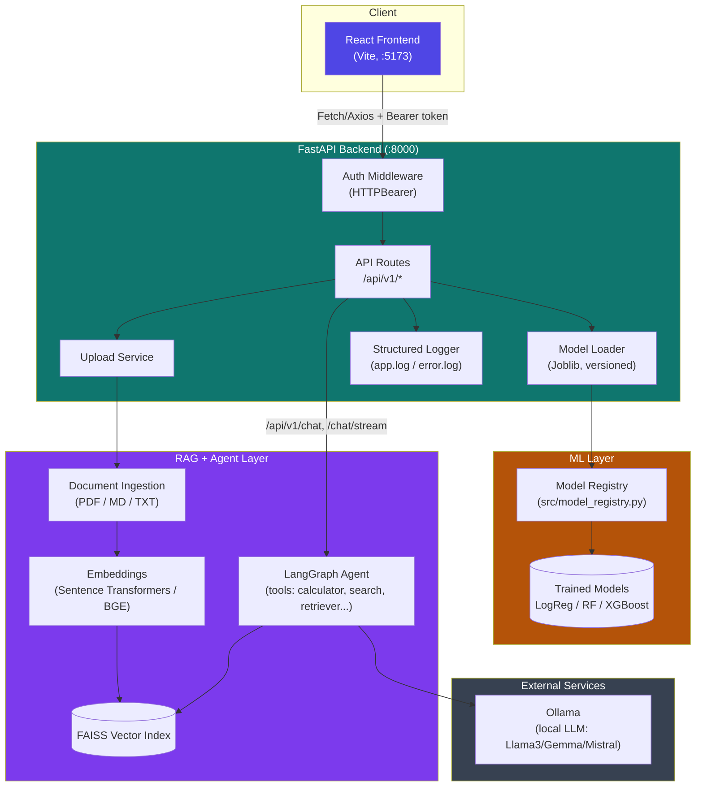
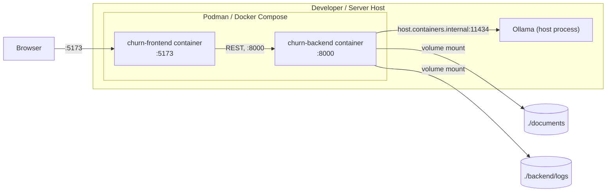

# Architecture — Production-Ready AI Knowledge Platform

## Overview

This platform combines a machine learning prediction service (customer churn) with a Retrieval-Augmented Generation (RAG) chatbot, served through a single FastAPI backend and a React frontend. Inference for the chatbot runs locally via Ollama; document retrieval uses a FAISS vector index built from uploaded documents.

## System Diagram

## Component Breakdown

### Frontend (`frontend/`)

- **Framework:** React + Vite
- **Key areas:** Sidebar navigation, chat panel with history, churn prediction form, document upload, theme toggle (dark/light, persisted via `localStorage`)
- **Communication:** REST calls to the backend via `services/api.js`, authenticated with a bearer token (`VITE_API_TOKEN`)

### Backend (`backend/`)

- **Framework:** FastAPI
- **Auth:** `HTTPBearer` token check (`verify_token`) applied to protected routes
- **Versioning:** All routes are namespaced under `/api/v1/`; model predictions also accept a `model_version` parameter resolved against the model registry
- **Validation:** Pydantic schemas (`Customer`, `PredictionResponse`, `ChatRequest`)
- **Logging:** Structured logs written to `backend/logs/app.log` and `error.log`
- **Health check:** `/api/v1/health` reports Ollama connectivity and FAISS index availability

### ML Layer (`src/`, `models/`)

- Models trained and tuned in Week 1 (Logistic Regression, Random Forest, XGBoost)
- Tracked via MLflow, versioned via DVC, persisted with Joblib
- Loaded on demand by `model_loader.py`, resolved through the model registry by name + version

### RAG + Agent Layer (`rag/`, `agent/`)

- Document ingestion pipeline supports PDF, Markdown, and plain text
- Embeddings generated with Sentence Transformers / BAAI BGE
- Vectors stored in FAISS, queried with metadata filtering for grounded answers
- LangGraph-based agent adds multi-step reasoning and tool use (calculator, Wikipedia, DuckDuckGo search, Python REPL, file reader, document retriever)

### External Services

- **Ollama:** serves the local open-source LLM used for chat generation
- Reached by the backend container via `host.containers.internal` (Podman/Docker host networking) so it can use the LLM already running on the host machine

## Deployment Topology

Environment variables (`API_TOKEN`, `OLLAMA_BASE_URL`, `VITE_API_BASE_URL`, `VITE_API_TOKEN`) are supplied via `.env` (root, consumed by the backend service and Compose build args) and `frontend/.env` (consumed directly by the frontend container). Neither file is committed; `.env.example` files document the required keys.

## CI/CD

GitHub Actions (`.github/workflows/ci.yml`) runs on every push/PR to `main`:

1. **backend** — installs dependencies, downloads the test dataset, runs `pytest`
2. **frontend** — installs dependencies, runs `npm run build`
3. **lint** — runs Ruff, Black, and isort checks (pinned versions matching `.pre-commit-config.yaml`)
4. **docker-build** — validates both the backend `Containerfile` and the frontend `Containerfile` build successfully